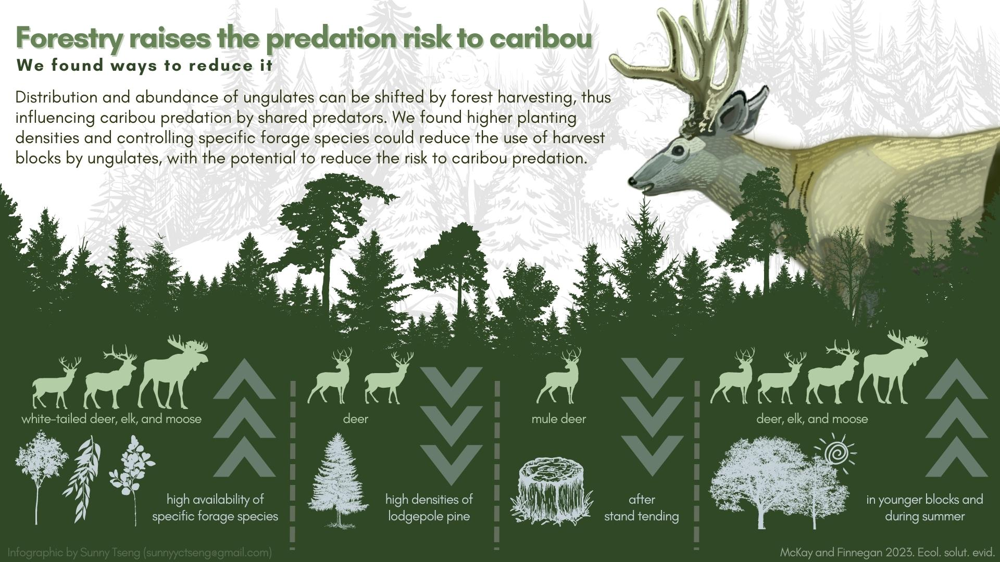

# Infographic about ungulates in harvest blocks

## About

The paper is entitled "Ungulate occurrence in forest harvest blocks is influenced by forage availability, surrounding habitat and silviculture practices", which is published in 2023 (McKay et al., 2023). The goal of this project is to create an infographic for this research paper!

## Paper infomation

- [Journal article](/docs/paper.pdf)

- [Short note of research outcome](/docs/CP_2023_05_Ungulate-Forestry-QN-v2.pdf)

## Product 

### version  (2023.07.11)

Inforgraphic in different formats can be downloaded here: [PDF](docs/infographic_ungulates_harvest_Tracy_v3.pdf), [PNG](docs/infographic_ungulates_harvest_Tracy_v3.png), or [JPG](docs/infographic_ungulates_harvest_Tracy_v3.jpg).

### version 2 (2023.06.29)

Inforgraphic in different formats can be downloaded here: [PDF](docs/infographic_ungulates_harvest_Tracy_v2.pdf), [PNG](docs/infographic_ungulates_harvest_Tracy_v2.png), or [JPG](docs/infographic_ungulates_harvest_Tracy_v2.jpg).

### version 1 (2023.06.15)

## Time line

| Deliverable | Due | Review |
| ----------- | ------------- | ------ |
| Content and relevant info | May 19 (Fri.) | agree on the draft |
| Visual design | May 23 (Fri.) |  |
| Text design | June 8 (Thur.) |  |
| First product | June 9 (Fri.) | review of the product |
| Revision(s) | June 12 (Mon.) |  |

## Tools

I will be using these two platforms for designing: 

- [GIMP](https://www.gimp.org/): an image editor for most of the visual design, including digital drawing.

- [Canva](https://www.canva.com/): a design tool for presentations and social media. I will be using canva for the text design. 

Example of my design style: 

## Expected output

- Dimension: 1920x1080 pixel (same dimension as products above)
- Orientation: Horizental
- File type: PNG, JPEG, PDF

## Expected compensation

Between \$770 - \$870, with around 30-35 working hours expected for the work 

| Hours | Task |
| --- | --- |
| 4 | materials and infomation collection |
| 5 | communication |
| 12 | visual design |
| 4 | text design |
| 3 | review and final editing of the work |
| 2 | others |

## References

- [FUSE consulting company](https://www.fuseconsulting.ca/infographics)
- [FRI research](https://friresearch.ca/search/?frisearchable_posts%5BhierarchicalMenu%5D%5Btaxonomies_hierarchical.publication_type.lvl0%5D%5B0%5D=Summaries%20and%20Communications&frisearchable_posts%5BhierarchicalMenu%5D%5Btaxonomies_hierarchical.publication_type.lvl0%5D%5B1%5D=Infographics)

